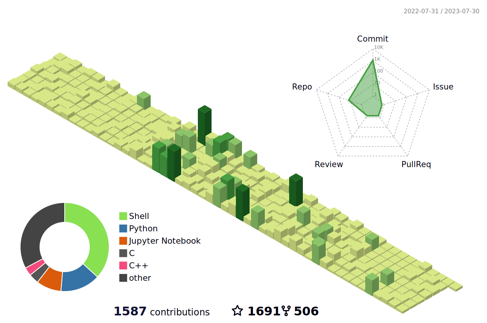
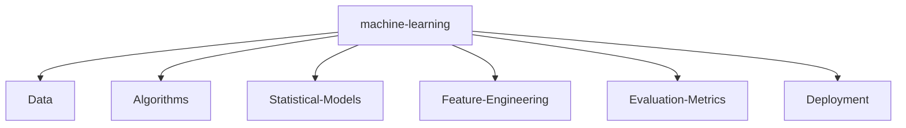

<!--   my-icons -->

    
    
    
    <a href="https://github.com/JUSTINAYA/JUSTINAYA/network/members">

<!--   my-header-img -->

<!--   my-ticker -->    

<!--   my-skils -->

| Property              | Data                                                         |
| --------------------- | ------------------------------------------------------------ |
| **Language / IDE**    |    |
| **Domain Knownledge** |     |
| **CI / CD**           |    |
| **Databases**         |   |
| **OS**                |  |
| **Tools & Platform**  |   |

<!--   GitHub stats graph -->
### 📈 GitHub Activity Graph:

| .                                                            | .                                                            |
| ------------------------------------------------------------ | ------------------------------------------------------------ |
|  |  |

</img>

<!--   profile-green-animate -->

<!--   grid-snake -->

<!--   skyline 

-->

<!--  2d history skills -->
</img>

   <!--machine-learning-->

 

Trophy: Hackerrank Profile Trophy

 

#### Thanks for visiting :heart:

 
  

## Star History

### Profile Views
counting of visitors to this page in this section started from June 12, 2022

 

[MIT](LICENSE)

